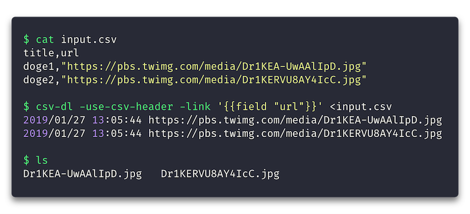

# csv-dl

`csv-dl` reads CSV on stdin, and downloads linked files.



- [Examples](#examples)
  - [Field names from CSV header](#field-names-from-csv-header)
  - [Field values by column index](#field-values-by-column-index)
  - [Field names from CLI args](#field-names-from-cli-args)
  - [Relative/incomplete links](#relativeincomplete-links)
  - [Multiple links per row](#multiple-links-per-row)
- [Get it](#get-it)
- [Usage](#usage)

## Examples

### Field names from CSV header

**input.csv**
```csv
"app","version","url"
csv-dl,0.0.1,https://github.com/sgreben/csv-dl/releases/download/0.0.1/csv-dl_0.0.1_linux_x86_64.zip
```

```sh
$ <input.csv csv-dl -u -l '{{field "url"}}'
2019/01/27 12:25:41 https://github.com/sgreben/csv-dl/releases/download/0.0.1/csv-dl_0.0.1_linux_x86_64.zip

$ ls
csv-dl_0.0.1_linux_x86_64.zip
```

### Field values by column index

**input.csv**
```csv
csv-dl,0.0.1,https://github.com/sgreben/csv-dl/releases/download/0.0.1/csv-dl_0.0.1_linux_x86_64.zip
```

```sh
$ <input.csv csv-dl -l '{{column 2}}'
2019/01/27 12:25:41 https://github.com/sgreben/csv-dl/releases/download/0.0.1/csv-dl_0.0.1_linux_x86_64.zip

$ ls
csv-dl_0.0.1_linux_x86_64.zip
```

### Field names from CLI args

**input.csv**
```csv
csv-dl,0.0.1,https://github.com/sgreben/csv-dl/releases/download/0.0.1/csv-dl_0.0.1_linux_x86_64.zip
```

```sh
$ <input.csv csv-dl -s ',,url' -l '{{field "url"}}'
2019/01/27 12:25:41 https://github.com/sgreben/csv-dl/releases/download/0.0.1/csv-dl_0.0.1_linux_x86_64.zip

$ ls
csv-dl_0.0.1_linux_x86_64.zip
```

### Relative/incomplete links

**input.csv**
```csv
csv-dl,0.0.1,"0.0.1/csv-dl_0.0.1_linux_x86_64.zip"
```

```sh
$ <input.csv csv-dl -s ',,link' -l 'https://github.com/sgreben/csv-dl/releases/download/{{field "link"}}'
2019/01/27 12:25:41 https://github.com/sgreben/csv-dl/releases/download/0.0.1/csv-dl_0.0.1_linux_x86_64.zip

$ ls
csv-dl_0.0.1_linux_x86_64.zip
```

### Multiple links per row

**input.csv**
```csv
name,title,release,source
csv-dl,0.0.1,https://github.com/sgreben/csv-dl/releases/download/0.0.1/csv-dl_0.0.1_linux_x86_64.zip,https://github.com/sgreben/csv-dl/archive/0.0.1.tar.gz
```

```sh
$ <input.csv csv-dl -u -l '{{field "release"}}' -l '{{field "source"}}'
2019/01/27 12:42:23 https://github.com/sgreben/csv-dl/releases/download/0.0.1/csv-dl_0.0.1_linux_x86_64.zip
2019/01/27 12:42:23 https://github.com/sgreben/csv-dl/archive/0.0.1.tar.gz

$ ls
0.0.1.tar.gz
csv-dl_0.0.1_linux_x86_64.zip
```

## Get it

Using go get:

```bash
go get -u github.com/sgreben/csv-dl
```

Or [download the binary](https://github.com/sgreben/csv-dl/releases/latest) from the releases page.

```bash
# Linux
curl -LO https://github.com/sgreben/csv-dl/releases/download/1.3.0/csv-dl_1.3.0_linux_x86_64.zip
unzip csv-dl_1.3.0_linux_x86_64.zip

# OS X
curl -LO https://github.com/sgreben/csv-dl/releases/download/1.3.0/csv-dl_1.3.0_osx_x86_64.zip
unzip csv-dl_1.3.0_osx_x86_64.zip

# Windows
curl -LO https://github.com/sgreben/csv-dl/releases/download/1.3.0/csv-dl_1.3.0_windows_x86_64.zip
unzip csv-dl_1.3.0_windows_x86_64.zip
```

## Usage

```text
Usage of csv-dl:
  -H value
    	(alias for -http-header)
  -dry-run
    	only print URLs to stdout (one per line), do not download
  -f	(alias for -force-overwrite)
  -force-overwrite
    	overwrite existing files
  -http-header value
    	a HTTP header KEY:VALUE
  -l value
    	(alias for -link)
  -link value
    	a link to download, may use go {{template}} syntax and refer to data columns by index (column i) or name (field "f")
  -n	(alias for -dry-run)
  -p int
    	(alias for -parallel) (default 8)
  -parallel int
    	number of parallel connections (default 8)
  -q	(alias for -quiet)
  -quiet
    	suppress all logging
  -r duration
    	(alias for -rate-limit)
  -rate-limit duration
    	at most one-request-per-$duration (0 = off)
  -s string
    	(alias for -schema)
  -schema string
    	use the given CSV expression as the table schema
  -skip-csv-header
    	assume the first row is the CSV header, skip it
  -u	(alias for -use-csv-header)
  -use-csv-header
    	assume the first row is the CSV header, use it as a schema
```
